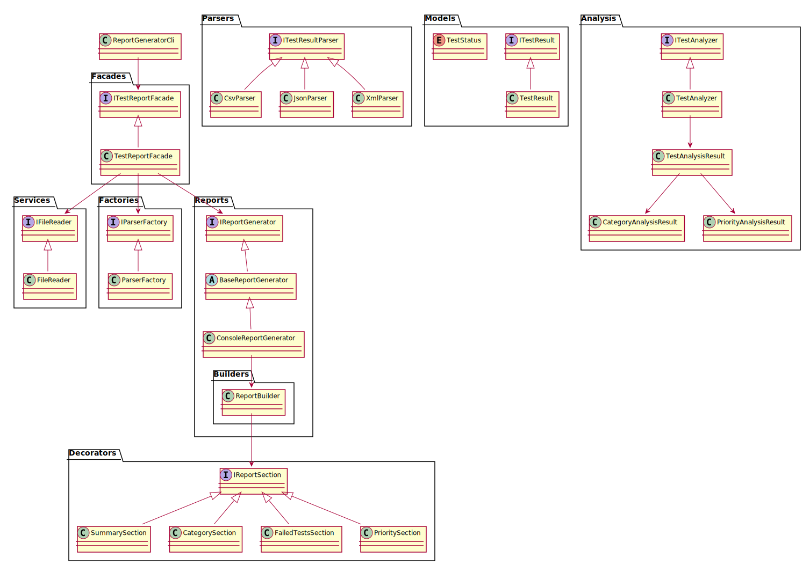

# Refactoring Report

## 1. Summary

 - **Responsibilities Extracted**: Separated file I/O, parsing, analysis, and report generation into dedicated services.
 - **Data Modeling**: Introduced `ITestResult` interface and `TestStatus` enum; refactored `TestResult` to enforce consistency.
 - **Design Patterns**:
   - **Factory**: `ParserFactory` for parser instantiation.
   - **Strategy**: `CsvParser`, `JsonParser`, `XmlParser` implement `ITestResultParser`.
   - **Builder**: `ReportBuilder` composes report sections fluently.
   - **Decorator**: `IReportSection` implementations (`SummarySection`, `CategorySection`, `FailedTestsSection`, `PrioritySection`) for dynamic report composition.
   - **Template Method**: `BaseReportGenerator` defines the report generation skeleton; `ConsoleReportGenerator` implements console output.
   - **Facade**: `TestReportFacade` simplifies the overall workflow.
 - **Dependency Injection**: Configured services in `Program.cs` via DI container.
 - **CLI Simplification**: `ReportGeneratorCli` now depends only on `ITestReportFacade`.

 ## 2. Task Discovery & Resolution

 | File                       | Task Indicator     | Resolution                                               |
 |----------------------------|--------------------|---------------------------------------------------------|
 | `Program.cs`               | `TODO` / `HINT`    | Registered interfaces and implementations in DI container. |
 | `Models/TestResult.cs`     | `TODO` / `HINT`    | Added `ITestResult`, `TestStatus`; refactored `TestResult`. |
 | `Parser.cs`                | `IMPORTANT`        | Removed stub; implemented dedicated parsers in `Parsers/`. |
 | `ReportGeneratorCli.cs`    | Multiple `TODO`    | Delegated workflow to `ITestReportFacade`; removed business logic. |
 | Multiple files             | `TODO` / `HINT`    | Applied Factory, Strategy, Builder, Decorator, Template Method, and Facade patterns. |

 ## 3. Design Patterns

 | Pattern            | Intent                                   | Components                                                    |
 |--------------------|------------------------------------------|---------------------------------------------------------------|
 | Factory            | Parser instantiation based on extension | `IParserFactory`, `ParserFactory`                             |
 | Strategy           | Interchangeable parsing algorithms       | `ITestResultParser`, `CsvParser`, `JsonParser`, `XmlParser`   |
 | Builder            | Step-by-step report construction         | `ReportBuilder`                                               |
 | Decorator          | Dynamic report section composition       | `IReportSection`, `SummarySection`, `CategorySection`, `FailedTestsSection`, `PrioritySection` |
 | Template Method    | Standard report generation flow          | `BaseReportGenerator`, `ConsoleReportGenerator`               |
 | Facade             | Simplify subsystem API                  | `ITestReportFacade`, `TestReportFacade`                       |

 ## 4. UML Class Diagram

 See `uml/diagram.puml` for the class relationship overview.
 